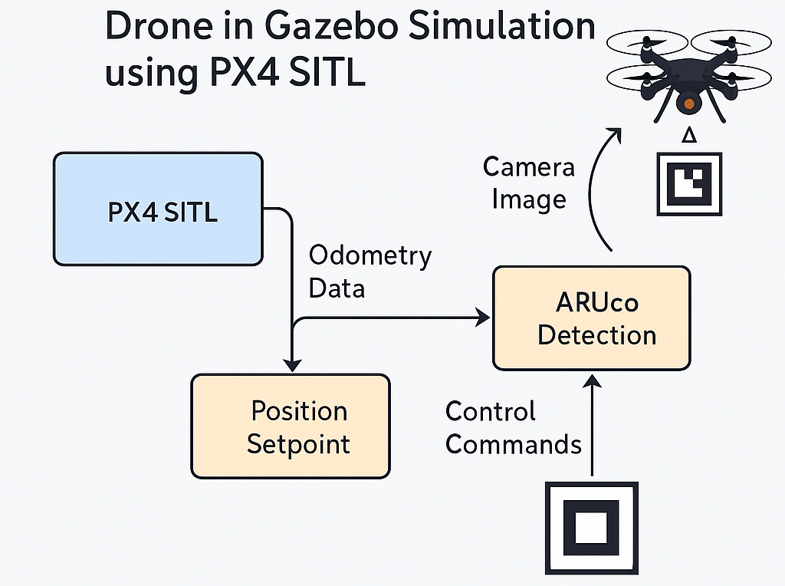

# Vision based precision landing of Drone in Gazebo Simulation using PX4 SITL
<div align="center">
  
</div>
## Overview
This package enables vision-based autonomous landing of a drone on an ArUco marker using PD (Proportional-Derivative) control.

## Installation

### 1. Dependencies
Ensure the following dependencies are installed before setting up the package:

- **ROS Noetic (or other compatible versions)**:
    ```bash
    sudo apt-get install ros-noetic-desktop-full
    ```

- **PX4-Autopilot**:
    Clone the PX4-Autopilot repository into your home directory:
    ```bash
    git clone https://github.com/PX4/PX4-Autopilot.git ~/PX4-Autopilot
    ```

### 2. Clone this Repository
Clone this repository into your ROS workspace:
```bash
cd ~/catkin_ws/src
git clone https://github.com/imsafwan/Drone_precision_landing.git
```
## 3. Setting Up the Environment

- **Source your ROS environment**:
    ```bash
    source /opt/ros/noetic/setup.bash
    source ~/catkin_ws/devel/setup.bash
    ```

- **Add the custom drone model to PX4 (if required)**:
    Copy the custom drone configuration file from the `airframes` folder of this repository to the PX4 directory:
    ```bash
    cp ~/catkin_ws/src/Drone_precision_landing_Gazebo/airframes/10016_iris_customized ~/PX4-Autopilot/ROMFS/px4fmu_common/init.d-posix/airframes/
    ```

- **Build the catkin workspace**:
    ```bash
    cd ~/catkin_ws
    catkin_make
    ```

## 4. How to Run the Simulation

To run the simulation, open multiple terminals and follow these steps:

1. **Launch the UAV in Gazebo**:
   In the first terminal:
    ```bash
    cd ~/catkin_ws
    source ~/catkin_ws/devel/setup.bash
    roslaunch Drone_precision_landing_Gazebo run_sim.launch
    ```
   > **Note**: You may need to update the directory paths for the PX4 package in `run_sim.launch` (in the `launch` folder) and `px4_gazebo_launch.sh` (in the `Scripts` folder) to match the path of your PX4 installation, if necessary.

2. **Execute the UAV Takeoff**:
   In a second terminal:
    ```bash
    cd ~/catkin_ws/src/Drone_precision_landing_Gazebo/Scripts
    python3 drone_takeoff.py
    ```

3. **Initiate the Landing Action for the UAV**:
   In a third terminal:
    ```bash
    cd ~/catkin_ws/src/Drone_precision_landing_Gazebo/Scripts
    python3 drone_land.py
    ```

This setup will launch the UAV simulation in Gazebo, initiate takeoff, and perform landing actions, each in separate terminals.

